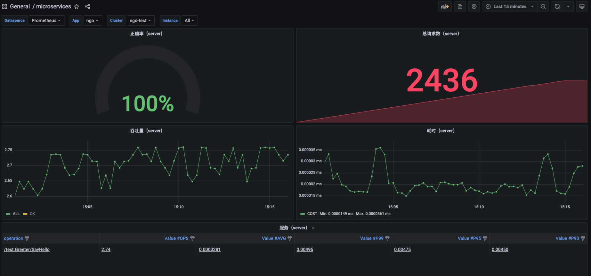
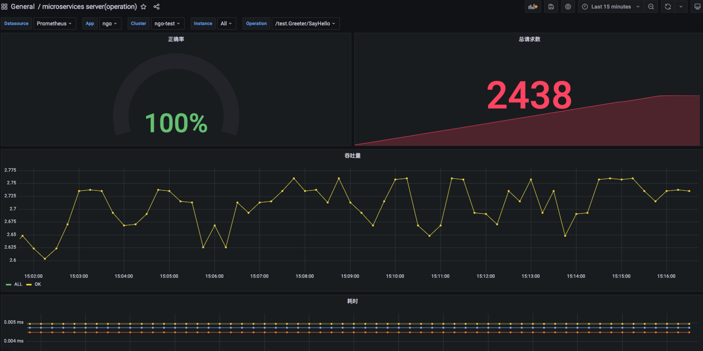

# metrics 插件
如何使用例子来快速使用 `metrics` 插件

## 文件描述
`conf/prometheus/prometheus.yml` prometheus配置文件，加入了采集主程序的`target`，并设置了应用`app`和集群`cluster`的标签

`grafana` 存放视图配置文件的目录，grafana启动后将视图文件导入进去

`test/main.go` 用来发起请求的脚本

`app.toml` 程序启动的配置文件

`main.go`  主程序文件

`docker-compose.yml` 整个示例跑在容器内，文件内包含所有需要用到的组件

`Dockerfile` 主程序的`docker`镜像构建文件

`setup.sql` 建库建表语句

## 执行过程
##### 第一步 确保安装了 `docker` 以及 `docker-compose`，启动服务
```
// 执行命令
docker-compose up
```
##### 第二步 编译测试程序`test/main.go`
```
cd test

// 执行命令
go build -o main .
```

##### 第三步 运行测试程序
```
// 执行命令
./main -c app.toml
```

##### 第四步 导入视图文件

打开[grafana地址](http://localhost:3000)，将grafana的文件导入到grafana中，grafana默认用户名密码为`admin:admin`

等待几分钟，查看视图，以下为部分组件视图截图


